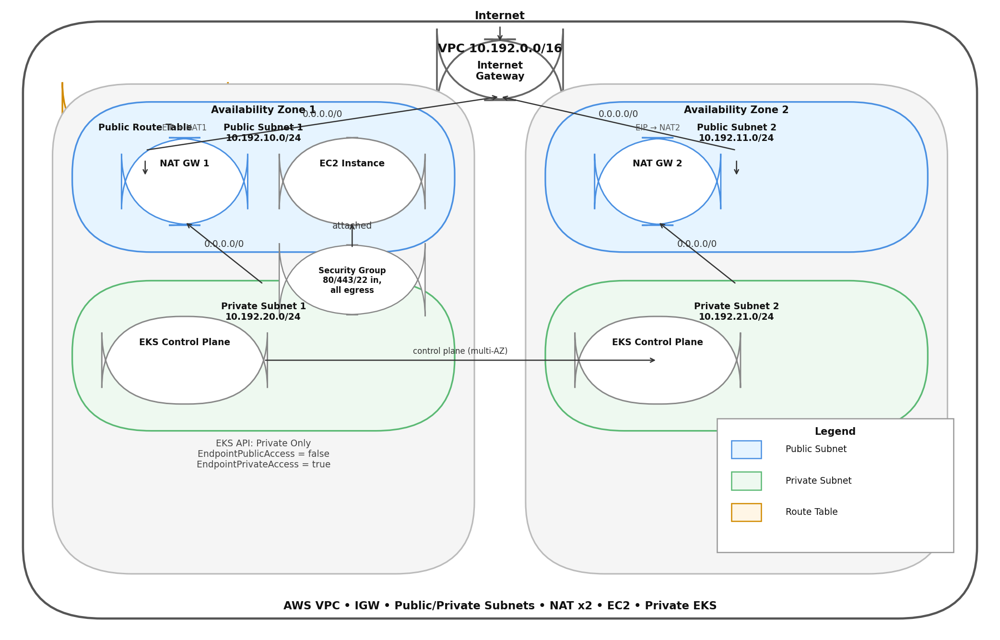
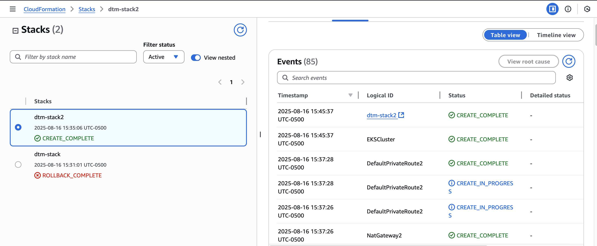
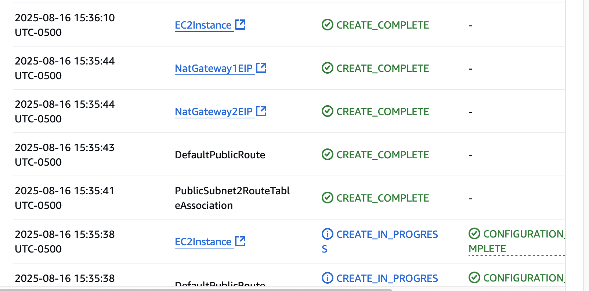
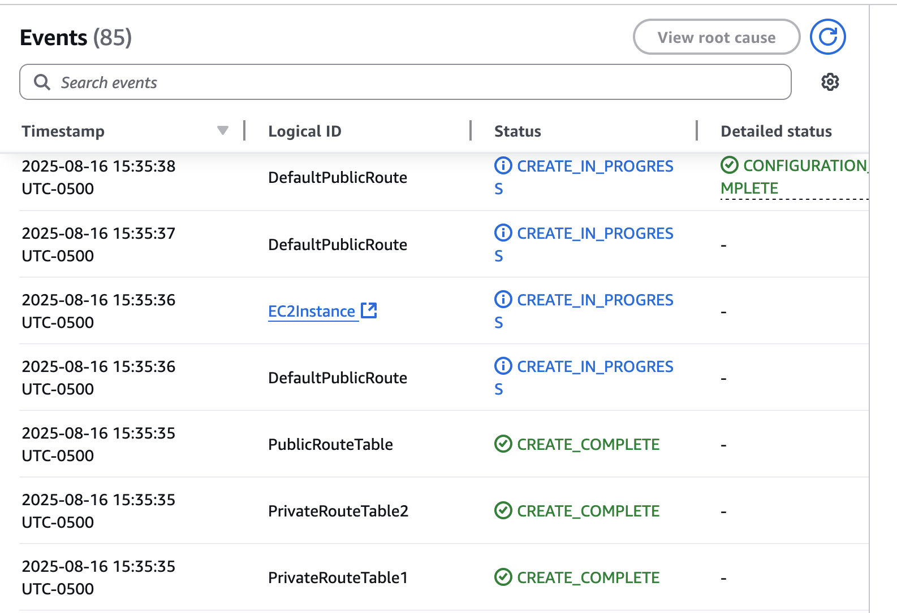
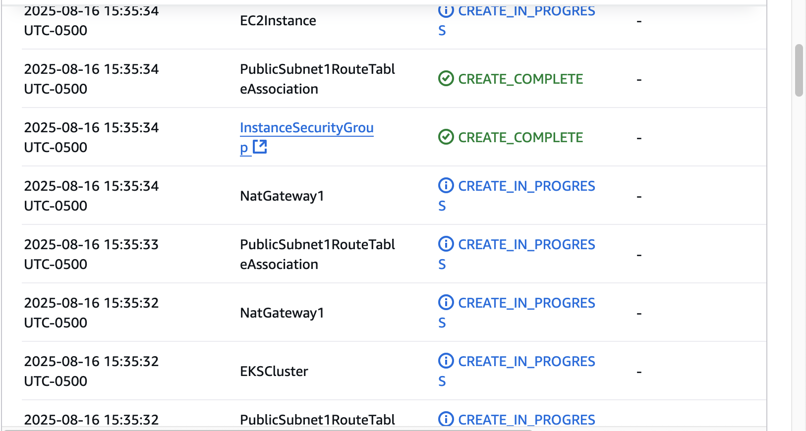
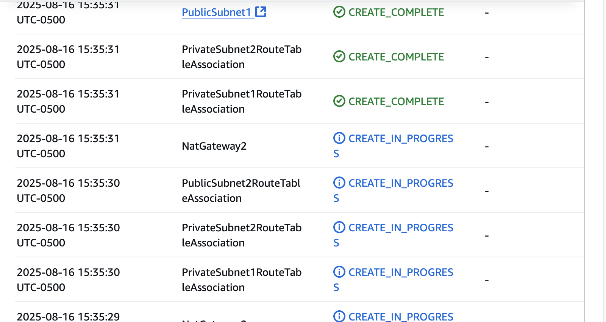

# AWS VPC + NAT + EC2 + (Private) EKS — CloudFormation






This stack stands up a **two-AZ network** with public and private subnets, Internet/NAT gateways, an EC2 key pair + instance, and an **EKS control plane with a private endpoint** (no public API). It’s a clean starting point for “hub-and-spoke” style app stacks or a private Kubernetes control plane you’ll later attach nodes to.

---

## What this template creates

* **VPC** with DNS support (`10.192.0.0/16` by default).
* **Two public subnets** (AZ1/AZ2) with auto-assign public IPs.
* **Two private subnets** (AZ1/AZ2) without public IPs.
* **Internet Gateway** + public route table with default route to IGW.
* **Two NAT Gateways** (one per AZ) + private route tables with default routes to NATs.
* **Security Group** allowing 80/443/22 inbound (open by default; tighten for prod).
* **EC2 Key Pair** and **one EC2 instance** in PublicSubnet1.
* **EKS Cluster (control plane only)** with **private API endpoint** (no node groups yet).

> ⚠️ **NAT costs**: This design uses **two** NAT Gateways (HA). Each NAT incurs hourly + data processing charges.

---

## Parameters

| Name                 | Default          | Purpose                                                           |
| -------------------- | ---------------- | ----------------------------------------------------------------- |
| `EnvironmentName`    | `prod`           | Tagging/name prefix for resources.                                |
| `VpcCIDR`            | `10.192.0.0/16`  | VPC CIDR. Adjust if it overlaps your existing networks.           |
| `PublicSubnet1CIDR`  | `10.192.10.0/24` | Public subnet in AZ1.                                             |
| `PublicSubnet2CIDR`  | `10.192.11.0/24` | Public subnet in AZ2.                                             |
| `PrivateSubnet1CIDR` | `10.192.20.0/24` | Private subnet in AZ1.                                            |
| `PrivateSubnet2CIDR` | `10.192.21.0/24` | Private subnet in AZ2.                                            |
| `EKSVersion`         | `"1.32"`         | EKS control plane version (must be **supported in your region**). |

> Tip: If you hit an EKS validation error, set `EKSVersion` to a widely supported version (e.g., `"1.30"`) for your region.


## EKS specifics

* The cluster **API endpoint is private only**:

  * `EndpointPublicAccess: false`
  * `EndpointPrivateAccess: true`
* You must access the cluster from inside the VPC (e.g., via a bastion/SSM or from worker nodes).
* The template configures control plane **logging** for `api` and `audit`.

> 🔧 **IAM Role**: Set `RoleArn` on `EKSCluster` to a **real** role in your account
> `arn:aws:iam::<YOUR_ACCOUNT_ID>:role/AmazonEKSClusterRole`
> Ensure it has at least `AmazonEKSClusterPolicy` attached and a trust policy allowing `eks.amazonaws.com`.

---

## Security Group

`InstanceSecurityGroup` opens:

* Inbound: `80`, `443`, `22` from `0.0.0.0/0` (world).
  🔒 For production, restrict SSH to your IP/CIDR or use **SSM Session Manager** instead of SSH.
* Egress: all.

---

## How to deploy

1. **Validate** the template:

```bash
cfn-lint -t template.yaml
aws cloudformation validate-template --template-body file://template.yaml
```

2. **Create/Update** the stack:

```bash
STACK_NAME=dtm-stack
aws cloudformation deploy \
  --template-file template.yaml \
  --stack-name $STACK_NAME \
  --capabilities CAPABILITY_NAMED_IAM \
  --parameter-overrides \
    EnvironmentName=prod \
    EKSVersion="1.30"
```

3. **Verify**:

* VPC, subnets, route tables, IGW, NATs in the VPC console.
* EC2 key pair exists and **you have the private key you intend to use** (see note below).
* EKS control plane shows **Active** with **Private** endpoint.

> 🔑 **KeyPair note**: Manage your SSH keys carefully. Many teams prefer **importing** an existing public key or using **SSM** for shell access to avoid distributing private keys.

---

## Next steps (common additions)

* **Managed Node Group** (or self-managed nodes) in the private subnets.
* **Cluster security group**/addons (CoreDNS, VPC CNI upgrades, kube-proxy).
* **Ingress**: Tag subnets for load balancers so the AWS Load Balancer Controller can place ALBs/NLBs as you expect:

  * Public subnets: `kubernetes.io/role/elb=1`
  * Private subnets: `kubernetes.io/role/internal-elb=1`
  * (Optionally) `kubernetes.io/cluster/<ClusterName>=shared`
* **Bastion/SSM**: Access to private cluster and nodes without opening SSH to the world.
* **Outputs**: Add `Outputs` for VPC/Subnet IDs if you’ll reference them from other stacks.

---

## Troubleshooting

* **`VALIDATION_FAILED … EKSCluster Tags`**: EKS `Tags` must be a **list** of `{Key,Value}` objects, not a single map.
* **Unsupported EKS version**: Use a version available in your region (`EKSVersion="1.30"` is a safe default in most regions).
* **Can’t reach EKS API**: With a **private** endpoint, ensure you’re inside the VPC (EC2/SSM tunnel/VPN) and your security groups/NACLs allow it.

---

## Cleanup

This stack creates **two NAT Gateways**; don’t forget to tear down when done:

```bash
aws cloudformation delete-stack --stack-name dtm-stack
aws cloudformation wait stack-delete-complete --stack-name dtm-stack
```

---

### File Structure 

```
.
├── template.yaml        # the CloudFormation template (this file)
├── README.md            # this write-up
└── diagrams/            # (optional) export of the diagram above
```


